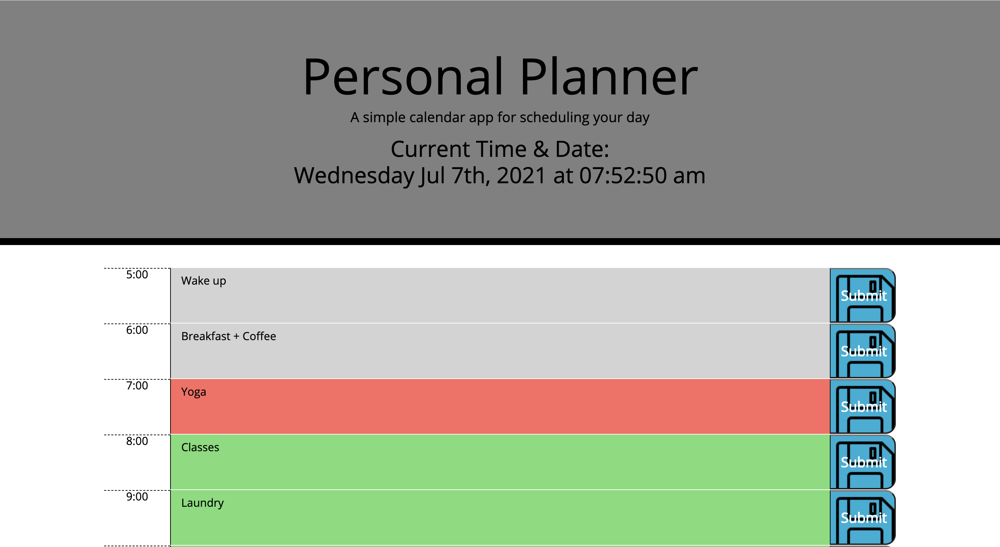

# Daily Planner

## Description 
This is a simple calendar application that allows a user to save events for each hour of the day. This app will run in the browser and feature dynamically updated HTML and CSS powered by jQuery.

The Moment.js library is used to work with date and time. 

## Demo

This application can be found here:
* https://alenareh.github.io/Planner/

The URL of the GitHub repository that contains the code of the application:
* https://github.com/AlenaReh/Planner

## Contributors

- Alena Rehberger <https://github.com/AlenaReh>

​
## Credits

Thanks to w3schools <https://w3schools.com> and Trilogy Education Services for providing all of the necessery tools for building this application.

